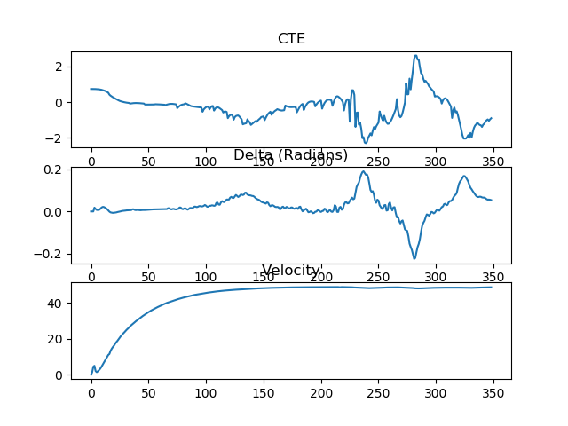
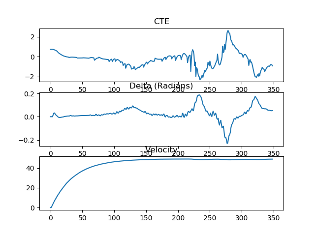
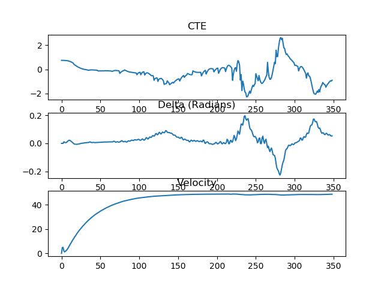

# CarND-Controls-MPC
Self-Driving Car Engineer Nanodegree Program

The project was not so difficult as most of the things were provided in the lecture quizzes. It was mostly about playing with the hyperparameters.
However, I have to admit the hardest part was the environment setup :D. It took me 2 days to configure it, and even now the working setup is quite modified. I am running the simulator on windows and running the code on Ubuntu ( via virtualbox ). Please find my concerns about code compilation in the section [Compilation and Environment Issues](#Compilation-and-Environment-Issues)

---

## Final Output

The model after implementation and tuning the hyperparameters gives the following output:


[Link to video](./videos/final.mp4)

## The Model

The model has the following parameters:

* Position: (x, y) coordinates
* Heading: psi
* Velocity: v
* Cross track error: cte
* Heading error: epsi
* Actuator related:
  * Steering: delta
  * Throttle: a
* The distance between the car mass and the front wheels: Lf 

The model is based on the following update equations:

```
x_[t+1] = x[t] + v[t] * cos(psi[t]) * dt
y_[t+1] = y[t] + v[t] * sin(psi[t]) * dt
psi_[t+1] = psi[t] + v[t] / Lf * delta[t] * dt
v_[t+1] = v[t] + a[t-1] * dt
cte[t+1] = f(x[t]) - y[t] + v[t] * sin(epsi[t]) * dt
epsi[t+1] = psi[t] - psides[t] + v[t] * delta[t-1] / Lf * dt
```

## Aim and objective of the model

As suggested in the lectures, the objective can be listed in the following steps:

1. Set N and dt.
2. Fit the polynomial to the waypoints.
3. Calculate initial cross track error and orientation error values.
4. Define the components of the cost function (state, actuators, etc).
5. Define the model constraints. These are the state update equations defined in the Vehicle Models module.
6. Send the values to the simulator.

The cost functions calculation:

- Square sum of `cte` and `epsi`. [ref to code](./src/MPC.cpp#L69).
- Minimize the use of actuators [ref to code](./src/MPC.cpp#L77).
- Minimize the value gap between sequential actuations [ref to code](./src/MPC.cpp#L85).

I played around with the factors with which I computed the cost functions. 
```
 for (size_t i = 0; i < N - 2; i++)
    {
      fg[0] += 255000 * CppAD::pow(vars[delta_start + i + 1] - vars[delta_start + i], 2);
      fg[0] += 5500 * CppAD::pow(vars[a_start + i + 1] - vars[a_start + i], 2);
    }
```

For eg. in the code below I played with the cost factor and I had the following observations:

(P.S: I used the plot example from the quizzes to plot these )

| <b>27000 & 7000</b> |
| ------------- |
| |

| <b>5000 & 25000</b> |
|:-------------:|
|

| <b>25500 & 5500 (Final)</b>          |
| :-------------:|
| |

If you will look closely the disturnace in the last plot in much lower than the previous two. Thus, the smooth steering angle transition can be observed in the lap run.

### Polynomial Fitting and MPC Preprocessing

The waypoints from the simulator were converted to the car coordinate system. It helps in reducing the computation time which is very important in case of our use case. The steering values were converted to range of [-1, 1].

After the conversion of the waypoints to the vehicle coordinate system, a 3rd degree polynomial was fitted. This helped in the calculation of the `cte` and `epsi`.

### Model Predictive Control with Latency

To overrule the latency, the states were computed using the model stated above with a certain delay interval.

### Timestep Length and Frequency

Timestep length (N) is chosen to be 7, and timestep frequency (dt) 0.1. The dt value fits the latency 100ms for the actuators.

The timestep and time interval depicts the prediction horizon. The optimum value of timestep length is important for efficient computation. It should be small but large enough to make as accurate prediction as possible. Very small values for e.g. 5 leads to very large jitters in the car trajectory and it eventually falls off the track. Too large values also lead to same situation as the computation frequency is low.

The timestep frquency also has similar restrictions. The impact of these two parameters on the car trajectory and performance are depicted in the gifs below. I have tried with various combinations, but have shown only 3 cases below. To see the full length videos, click on the link below each column.

The values of N and dt played significant role in trajectory calculation.

| N = 15, dt = 0.1 | N = 10, dt = 0.1 | N = 8, dt = 0.15 <b>racer :)</b> | N = 8, dt = 0.1 <b><u>Final</u></b>          |
| ------------- |:-------------:| :-------------:| :-------------:|
| | |  | |
| [Link to video](./videos/N15.mp4) | [Link to video](./videos/N10.mp4)|[Link to video](./videos/N8.mp4)| [Link to video](./videos/final.mp4)|

## Compilation and Environment Issues

As described briefly in the begining, I had multiple issues while configuring the environment for this project. Finally I was able to run it. I made the following changes:

1. Modified the main.cpp ( moved `#include "json.hpp"` above `MPC.h` `main.cpp`)
2. I modified the CMakeLists.txt ( Added `include_directories(/usr/local/include/coin)`)
3. To support matlibplot functions used within main.cpp, I modified the CMakeLists.txt by adding lib python2.7 in linking command `target_link_libraries(mpc ipopt z ssl uv uWS python2.7)`
4. For some reason if I run simulator and code on Ubuntu or Mac machines, the car does not work well on the circuit. However, if I run the code on Ubuntu (Virtualbox) and simulator on windows, everything works as per expectations.

Please let me know in case there are similar issues while running it on other machines as well. As a proof of working model :), I have recorded the following video [link to video](./videos/working_proof.mp4)

## Dependencies

* cmake >= 3.5
 * All OSes: [click here for installation instructions](https://cmake.org/install/)
* make >= 4.1(mac, linux), 3.81(Windows)
  * Linux: make is installed by default on most Linux distros
  * Mac: [install Xcode command line tools to get make](https://developer.apple.com/xcode/features/)
  * Windows: [Click here for installation instructions](http://gnuwin32.sourceforge.net/packages/make.htm)
* gcc/g++ >= 5.4
  * Linux: gcc / g++ is installed by default on most Linux distros
  * Mac: same deal as make - [install Xcode command line tools]((https://developer.apple.com/xcode/features/)
  * Windows: recommend using [MinGW](http://www.mingw.org/)
* [uWebSockets](https://github.com/uWebSockets/uWebSockets)
  * Run either `install-mac.sh` or `install-ubuntu.sh`.
  * If you install from source, checkout to commit `e94b6e1`, i.e.
    ```
    git clone https://github.com/uWebSockets/uWebSockets
    cd uWebSockets
    git checkout e94b6e1
    ```
    Some function signatures have changed in v0.14.x. See [this PR](https://github.com/udacity/CarND-MPC-Project/pull/3) for more details.

* **Ipopt and CppAD:** Please refer to [this document](https://github.com/udacity/CarND-MPC-Project/blob/master/install_Ipopt_CppAD.md) for installation instructions.
* [Eigen](http://eigen.tuxfamily.org/index.php?title=Main_Page). This is already part of the repo so you shouldn't have to worry about it.
* Simulator. You can download these from the [releases tab](https://github.com/udacity/self-driving-car-sim/releases).
* Not a dependency but read the [DATA.md](./DATA.md) for a description of the data sent back from the simulator.


## Basic Build Instructions

1. Clone this repo.
2. Make a build directory: `mkdir build && cd build`
3. Compile: `cmake .. && make`
4. Run it: `./mpc`.
