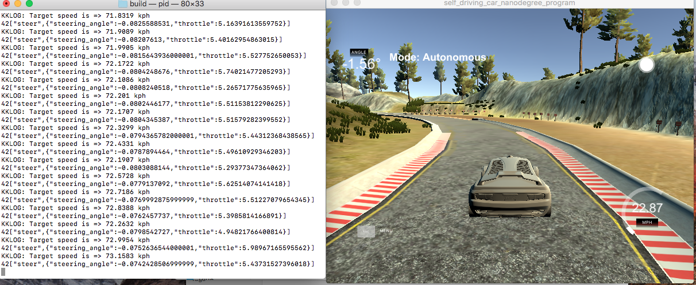

# CarND-Controls-PID
Self-Driving Car Engineer Nanodegree Program
### Output screen
---


### Output videos
| Full PID controlled car        | Only Steer PID | Only P           | Only I        | Only D           |
| ------------- |:-------------:| :-------------:|:-------------:| :-------------:| :-------------:|
| | | |||

---
## Reflection
### Describe the effect each of the P, I, D components had in your implementation.

1. **P -** The proportional part of the PID tries to steer the car in proportion or against to the cross track error (cte). This results in the direct distance of the car to the center labe. If the car is too far to the right, it steers strongly towards the left. If only P is used the car swings across the center lane and goes out of the track quickly. The proportional factor (Kp) is multiplied with the cte for calculating the steering angle. Thus, higher the Kp higher the oscillation of the vehicle across the center lane. The example video showing this behavior is at [./videos/only_p.mp4](./videos/only_p.mp4)

2. **I -** The integral part works on removing the system bias for example a steering drift. Its a counteract bias which tries to prevent the PD controller from reaching the center lane of the road. This is helpful to reduce CTE on the curves. The integral factor Ki is multiplied with summation of all the previous CTE. In our case, the Ki is close to 0 as drifting is not present. If only integral is present, the car behaves as shown in the video [./videos/only_i.mp4](./videos/only_i.mp4)

3. **D -** The differential part tries to reduce the steering angle once it reaches the reference trajectory, i.e. center line. It is done by smoothing the value once vehicle approaches the center lane. If used alone the car behaves as shown in the video [./videos/only_d.mp4](./videos/only_d.mp4)

### PID for steering angle and speed

I implemented two PID controls:

* Steering angle: The final values for the PID controller for steering angle are as below
  * P =>  0.09671100
  * I =>  0.0000171
  * D =>  1.8992100

* Speed: The final values for the PID controller for the speed are as below
  * P =>  0.1092310
  * I =>  0.0007210
  * D =>  0.8510000

I choose the above values mostly by manual tuning. A usual hit and trial approach. Since, the use case was without drift, setting *integral* value was easy. To set the values of *proportion* and *differential* I started with the values introduced in the lecture, however, later I started adding/subtracting small values from each and tried to find the best combination for me.

Initially, I tried only one PID controller. It was for the steering angle. But, since I didnt controlled the speed in anyway, the car went off the track after certain point. This video will give you an idea of the behavior [./videos/only_steer_pid.mp4](./videos/only_steer_pid.mp4).

Then I had two options, either to add some if/else clause to control the speed according to the change of position of the car or to add a PID controller for the speed. Later was easy and more robust. At the end, my final implementation was able to control the car on the track. The car drove quite well and completed multiple rounds. The video can be seen at [./videos/final_pid_controlled.mp4](./videos/final_pid_controlled.mp4).

### Parameter optimization

I also used *twiddle* algorithm to find better value of the parameters. It was introduced in the lecture and I used similar implementation in my code. The idea behind the algorithm is simple, Other option was to choose Gradient Descent algorithm however, due to lack of time, I couldnt try it.

To run with twiddle enabled, the exec should be run as:

  `$> ./pid twiddle`

## Dependencies

* cmake >= 3.5
 * All OSes: [click here for installation instructions](https://cmake.org/install/)
* make >= 4.1(mac, linux), 3.81(Windows)
  * Linux: make is installed by default on most Linux distros
  * Mac: [install Xcode command line tools to get make](https://developer.apple.com/xcode/features/)
  * Windows: [Click here for installation instructions](http://gnuwin32.sourceforge.net/packages/make.htm)
* gcc/g++ >= 5.4
  * Linux: gcc / g++ is installed by default on most Linux distros
  * Mac: same deal as make - [install Xcode command line tools]((https://developer.apple.com/xcode/features/)
  * Windows: recommend using [MinGW](http://www.mingw.org/)
* [uWebSockets](https://github.com/uWebSockets/uWebSockets)
  * Run either `./install-mac.sh` or `./install-ubuntu.sh`.
  * If you install from source, checkout to commit `e94b6e1`, i.e.
    ```
    git clone https://github.com/uWebSockets/uWebSockets 
    cd uWebSockets
    git checkout e94b6e1
    ```
    Some function signatures have changed in v0.14.x. See [this PR](https://github.com/udacity/CarND-MPC-Project/pull/3) for more details.
* Simulator. You can download these from the [project intro page](https://github.com/udacity/self-driving-car-sim/releases) in the classroom.

There's an experimental patch for windows in this [PR](https://github.com/udacity/CarND-PID-Control-Project/pull/3)

## Basic Build Instructions

1. Clone this repo.
2. Make a build directory: `mkdir build && cd build`
3. Compile: `cmake .. && make`
4. Run it: `./pid`. 

Tips for setting up your environment can be found [here](https://classroom.udacity.com/nanodegrees/nd013/parts/40f38239-66b6-46ec-ae68-03afd8a601c8/modules/0949fca6-b379-42af-a919-ee50aa304e6a/lessons/f758c44c-5e40-4e01-93b5-1a82aa4e044f/concepts/23d376c7-0195-4276-bdf0-e02f1f3c665d)

## Editor Settings

We've purposefully kept editor configuration files out of this repo in order to
keep it as simple and environment agnostic as possible. However, we recommend
using the following settings:

* indent using spaces
* set tab width to 2 spaces (keeps the matrices in source code aligned)

## Code Style

Please (do your best to) stick to [Google's C++ style guide](https://google.github.io/styleguide/cppguide.html).

## Project Instructions and Rubric

Note: regardless of the changes you make, your project must be buildable using
cmake and make!

More information is only accessible by people who are already enrolled in Term 2
of CarND. If you are enrolled, see [the project page](https://classroom.udacity.com/nanodegrees/nd013/parts/40f38239-66b6-46ec-ae68-03afd8a601c8/modules/f1820894-8322-4bb3-81aa-b26b3c6dcbaf/lessons/e8235395-22dd-4b87-88e0-d108c5e5bbf4/concepts/6a4d8d42-6a04-4aa6-b284-1697c0fd6562)
for instructions and the project rubric.

## Hints!

* You don't have to follow this directory structure, but if you do, your work
  will span all of the .cpp files here. Keep an eye out for TODOs.

## Call for IDE Profiles Pull Requests

Help your fellow students!

We decided to create Makefiles with cmake to keep this project as platform
agnostic as possible. Similarly, we omitted IDE profiles in order to we ensure
that students don't feel pressured to use one IDE or another.

However! I'd love to help people get up and running with their IDEs of choice.
If you've created a profile for an IDE that you think other students would
appreciate, we'd love to have you add the requisite profile files and
instructions to ide_profiles/. For example if you wanted to add a VS Code
profile, you'd add:

* /ide_profiles/vscode/.vscode
* /ide_profiles/vscode/README.md

The README should explain what the profile does, how to take advantage of it,
and how to install it.

Frankly, I've never been involved in a project with multiple IDE profiles
before. I believe the best way to handle this would be to keep them out of the
repo root to avoid clutter. My expectation is that most profiles will include
instructions to copy files to a new location to get picked up by the IDE, but
that's just a guess.

One last note here: regardless of the IDE used, every submitted project must
still be compilable with cmake and make./

## How to write a README
A well written README file can enhance your project and portfolio.  Develop your abilities to create professional README files by completing [this free course](https://www.udacity.com/course/writing-readmes--ud777).

